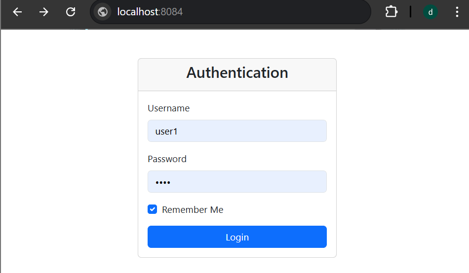
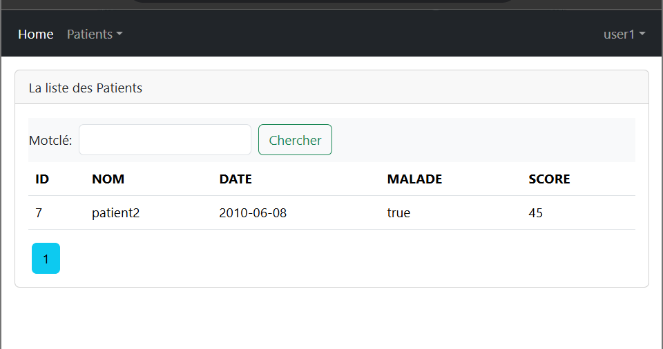
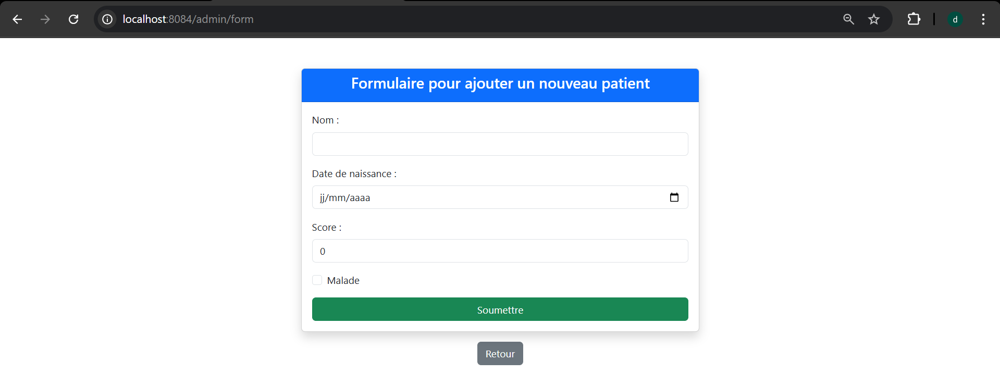
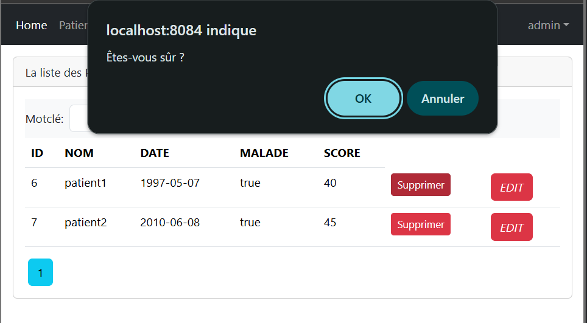
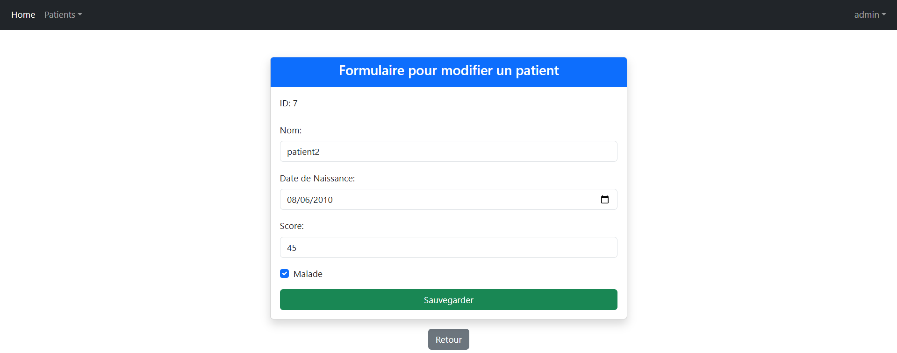

# Projet de gestion des patients - Spring Boot, Spring MVC & Thymeleaf
## Description

Cette application Web JEE permet de gérer une liste de patients, effectuer des recherches par mot-clé, et exécuter des actions administratives telles que la suppression et l'édition des patients. Elle est basée sur Spring Boot, Spring MVC, Spring Data JPA, Thymeleaf, et utilise une base de données H2.
## Fonctionnalités

- Affichage de la liste des patients
- Recherche par mot-clé
- Suppression de patients (accessible uniquement aux utilisateurs avec le rôle ADMIN)
- Modification des informations d'un patient (accessible uniquement aux utilisateurs avec le rôle ADMIN)
- Pagination des résultats
- Utilisation de templates Thymeleaf pour l'interface utilisateur
  
### Technologies utilisées

- Java 23
- Spring Boot 3
- Spring MVC
- Spring Data JPA
- Spring security
- Thymeleaf
- Base de données ( H2, MySQL)
- Maven ou Gradle pour la gestion des dépendances  
- Bootstrap (pour l'interface utilisateur)

## Installation

1. Clonez ce dépôt sur votre machine locale :
   ```bash
   git clone https://github.com/d-sar/Activite_Pratique_N3
   
## Usage

1. Page d'accueil : L'utilisateur peut consulter la liste des patients.
2. Recherche de patients : Vous pouvez entrer un mot-clé pour rechercher des patients par nom.
3. Actions administratives : L'utilisateur avec le rôle ADMIN peut ajouter ou modifier ou supprimer des patients.

## Capture d'écrans

#### Page de connexion
Voici à quoi ressemble la page de connexion :

#### Liste des patients
Une fois connecté, l'utilisateur peut voir la liste des patients. La recherche par mot-clé peut être effectuée directement depuis cette page.

#### L'ajoute d'un patient
Les utilisateurs ayant le rôle ADMIN peuvent ajouter un patient. Cliquez sur le bouton "Nouvelle" dans le menu "Patients".

#### Suppression d'un patient
Les utilisateurs ayant le rôle ADMIN peuvent supprimer un patient de la liste. Cliquez sur le bouton "Supprimer" à côté du patient pour effectuer cette action.

#### Édition d'un patient
Les utilisateurs ADMIN peuvent également modifier les informations d'un patient en cliquant sur le bouton "EDIT".
