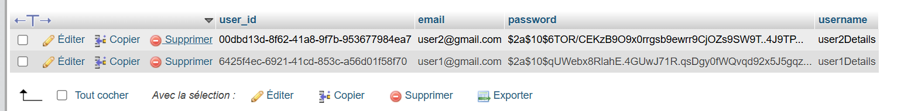
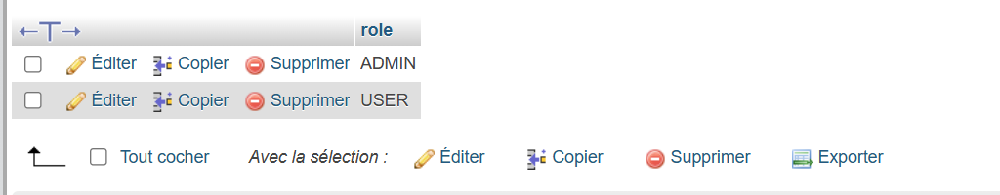
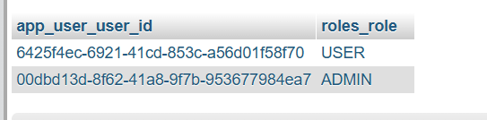
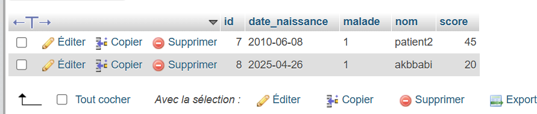

# 🏥 Projet de Gestion des Patients - Spring Boot & Thymeleaf


## 📌 Sommaire

- [📖 Description](#description)
- [✨ Fonctionnalités](#fonctionnalités)
- [🛠️ Technologies Utilisées](#Technologies-Utilisées)
- [🔐 Authentification JDBC avec UserDetailsService](#authentification-jdbc-avec-userdetailsservice)
- [🚀 Installation](#installation)
- [⚙️ Utilisation](#utilisation)
- [📸 Galerie d'écrans](#galerie-décrans)
- [🗄️ Captures de la base de données](#captures-de-la-base-de-données)
- [📚 Références](#références)


## Description

Une application web complète pour la gestion des patients avec des fonctionnalités CRUD et un système d'authentification en mémoire.

## ✨Fonctionnalités

| Fonctionnalité | Description | Accès |
|----------------|-------------|-------|
| 👥 Liste des patients | Affichage paginé de tous les patients | Tous utilisateurs |
| 🔍 Recherche | Filtrage par nom ou mot-clé | Tous utilisateurs |
| 🗑️ Suppression | Suppression sécurisée des dossiers | Rôle ADMIN |
| ✏️ Édition | Mise à jour des informations patients | Rôle ADMIN |
| ➕ Ajout | Création de nouveaux dossiers | Rôle ADMIN |
| 🔐 Sécurité | Authentification et autorisation | Spring Security |
  
## 🛠️ Technologies-Utilisées

- **Backend**: 
  - 
  - 
  - 

- **Frontend**:
  - 
  - 

- **Base de données**:
  - 
  - 
  
## 🔐 Authentification en Mémoire

Le système utilise **Spring Security** avec une authentification en mémoire (in-memory) préconfigurée :
     
        @Bean
        public InMemoryUserDetailsManager inMemoryUserDetailsManager(PasswordEncoder passwordEncoder){
          String encodedPassword = passwordEncoder.encode("1234");
          return new InMemoryUserDetailsManager(
              User.withUsername("user1").password(encodedPassword).roles("USER").build(),
              User.withUsername("admin").password(encodedPassword).roles("USER","ADMIN").build()
          );
        }
## 🔐JDBC Authentication

        @Bean
        public JdbcUserDetailsManager JdbcUserDetailsManager(DataSource dataSource) {
            return new JdbcUserDetailsManager(dataSource);
        }

## 🔐 Authentification JDBC avec UserDetailsService
L’application utilise une implémentation personnalisée de `UserDetailsService` pour récupérer les utilisateurs depuis une base de données via JPA :

        @Service
        @AllArgsConstructor
        public class UserDetailServiceImp implements UserDetailsService {
            AccountService accountService;
            @Override
            public UserDetails loadUserByUsername(String username) throws UsernameNotFoundException {
                AppUser appUser =accountService.loadUserByUsername(username);
                if (appUser == null) throw new UsernameNotFoundException(String.format("User %s not found", username));
                String[] roles = appUser.getRoles().stream().map(u->u.getRole()).toArray(String[]::new);
                UserDetails userDetails = User
                    .withUsername(appUser.getUsername())
                    .password(appUser.getPassword())
                    .roles(roles).build();
            return userDetails;
            }
        }

## 🚀 Installation

1. Clonez ce dépôt sur votre machine locale :
   ```bash
   git clone https://github.com/d-sar/Activite_Pratique_N3
2. Se rendre dans le dossier du projet
   ```bash
    cd Activite_Pratique_N3
   
## Usage

1. Page d'accueil : L'utilisateur peut consulter la liste des patients.
2. Recherche de patients : Vous pouvez entrer un mot-clé pour rechercher des patients par nom.
3. Actions administratives : L'utilisateur avec le rôle ADMIN peut ajouter ou modifier ou supprimer des patients.

## 📸 Galerie d'écrans

#### Page de connexion
Voici à quoi ressemble la page de connexion :

#### Liste des patients
Une fois connecté, l'utilisateur peut voir la liste des patients. La recherche par mot-clé peut être effectuée directement depuis cette page.

#### L'ajoute d'un patient
Les utilisateurs ayant le rôle ADMIN peuvent ajouter un patient. Cliquez sur le bouton "Nouvelle" dans le menu "Patients".

#### Suppression d'un patient
Les utilisateurs ayant le rôle ADMIN peuvent supprimer un patient de la liste. Cliquez sur le bouton "Supprimer" à côté du patient pour effectuer cette action.

#### Édition d'un patient
Les utilisateurs ADMIN peuvent également modifier les informations d'un patient en cliquant sur le bouton "EDIT".


## 🗄️ Captures de la base de données

Voici un aperçu des tables principales dans MySQL :

####  Table app_user


####  Table app_role


####  Table app_user_roles (relation plusieurs-à-plusieurs)


####  Table patient



## 📚 Références
Spring Security - Documentation

Spring Data JPA - Reference Guide

Spring Boot - Official Site

